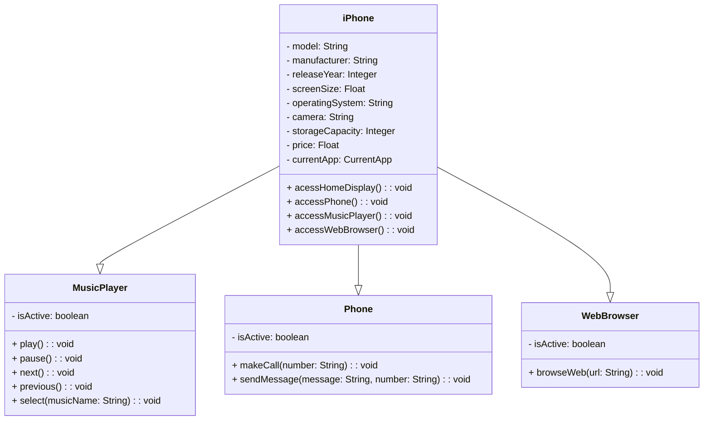

```mermaid
classDiagram
  class iPhone {
    - model: String
    - manufacturer: String
    - releaseYear: Integer
    - screenSize: Float
    - operatingSystem: String
    - camera: String
    - storageCapacity: Integer
    - price: Float
    - currentApp: CurrentApp
    + acessHomeDisplay(): void   
    + accessPhone(): void
    + accessMusicPlayer(): void
    + accessWebBrowser(): void
  }
  
  class MusicPlayer {
    - isActive: boolean
    + play(): void
    + pause(): void
    + next(): void
    + previous(): void
    + select(musicName: String): void
  }
  
  class Phone {
    - isActive: boolean
    + makeCall(number: String): void
    + sendMessage(message: String, number: String): void
  }
  
  class WebBrowser {
    - isActive: boolean
    + browseWeb(url: String): void
  }
  
  iPhone --|> MusicPlayer
  iPhone --|> Phone
  iPhone --|> WebBrowser
```
